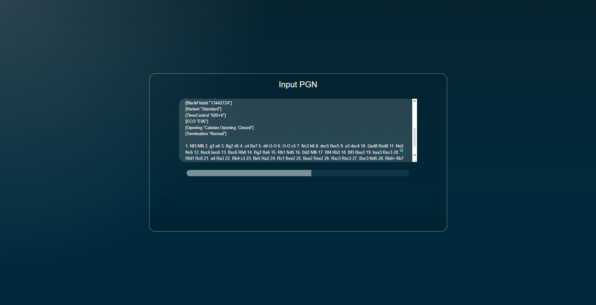
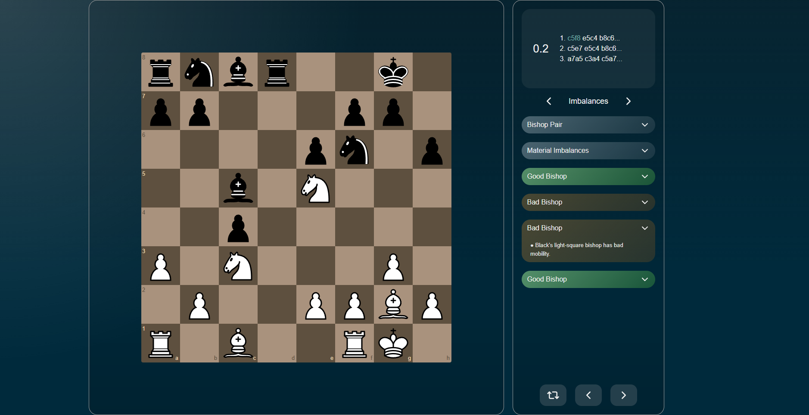
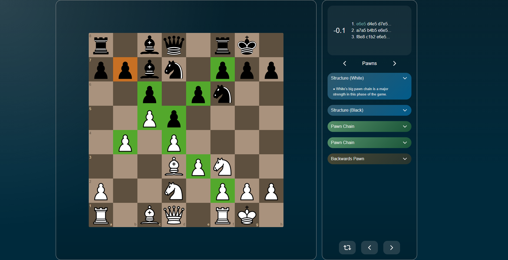

# Chess Analyzer

A chess analysis tool that aims to bridge the gap between engine evaluation and human understanding.

[Live Demo](https://msaghiri.github.io/chess-analyzer)

## Screenshots





## Description

This web app simplifies chess analysis by presenting positional features that highlight key strengths and weaknesses of both sides throughout a given game.


To derive these features, each position is analyzed individually. This analysis consists of:
- Obtaining an evaluation from Stockfish 17.1 ([stockfish.js](https://github.com/nmrugg/stockfish.js) is used, running in a web worker)
- Extracting heuristics/features such as, but not limited to:
  - Passed pawns
  - Backwards pawns
  - Pressure maps:
    - A pressure map is a map data structure that holds information about which squares are attacked by which pieces
  - Material count
- The heuristics are a part of the "context" (along with metadata, such as whose turn it is or how far into the game the position is), which is used to perform an analysis via a custom expert system
  - The expert system is modular and contains "rules" which are defined by a category (imbalances, pawns) and an evaluation function, which applies deterministic logic and returns a series of results that contain information such as:
    - Severity (significant weakness, minor weakness, neutral, minor advantage, or significant advantage)
    - Messages (certain predetermined textual explanations of common patterns, such as a bishop that is valuable due to a majority of its friendly pawns being on the opposite square color)
    
## Tech Stack

### Frontend

- **React 18** with TypeScript
- **Vite** for build tooling
- **react-chessboard** for interactive board rendering
- **chess.js** for chess logic and validation
- **Lucide React** for icons
- **CSS Modules** for styling

### Chess Engine

- **Stockfish 17.1** (WebAssembly via stockfish.js) - Depth 10 analysis with MultiPV=3 for top engine lines

## Getting Started

### Prerequisites

- Node.js 18+
- npm or yarn

### Installation

1.  Clone the repository:

```bash
git clone <repository-url>
cd <project-directory>
```

2.  Install dependencies:

```bash
cd frontend
npm install
```

3.  Start the development server:

```bash
npm run dev
```

4.  Open the URL shown in your terminal
